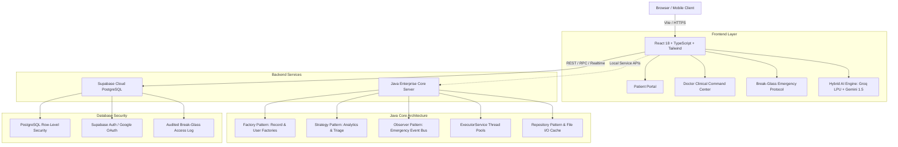

# Health-One Portal — A Java Based Healthcare Application

<div align="center">


<br/>

[](https://www.oracle.com/java/)
[](https://react.dev/)
[](https://www.typescriptlang.org/)
[](https://vitejs.dev/)
[](https://tailwindcss.com/)
[](https://supabase.com/)
[](https://groq.com/)
[](https://ai.google.dev/)

<p align="center">
  <strong>Next-Generation Lifetime Digital Health Record (EHR) & Emergency Break-Glass Access System</strong>
  <br />
  Engineered with high-performance <strong>Java Enterprise Architecture</strong>, GoF Design Patterns, Concurrency, and an AI-Powered Clinical Frontend.
</p>

</div>

---

## 🌟 Executive Overview

**Health-One Portal** is a resilient, patient-centric healthcare platform bridging clinical consultations, lifetime electronic medical records (EMR/EHR), and audited emergency responder access. 

Designed to eliminate healthcare data silos, Health-One couples a **high-concurrency Java backend service** with a modern **React & TypeScript Clinical Command Center**, backed by **Supabase PostgreSQL** (with granular Row-Level Security) and a **Hybrid Multi-LLM Clinical Intelligence Engine (Groq LPU + Google Gemini)**.

---

## 🏗️ Architecture & Tech Stack



### ☕ Core Java Backend
- **Language**: Java 17+ (JDK standard libraries, zero bloat)
- **Object-Oriented Design**: SOLID Principles & GoF Design Patterns:
  - **Factory Pattern**: `RecordFactory`, `UserFactory` for extensible record instantiation.
  - **Strategy Pattern**: `AnalyticsStrategy`, `SearchStrategy` for runtime calculation switching.
  - **Observer Pattern**: `AppointmentEventPublisher` & `EmergencyAccessListener` for event-driven logging.
  - **Repository Pattern**: Clean decoupling of data persistence layers.
- **Concurrency**: Thread-pool `ExecutorService` for non-blocking clinical analytics and file I/O operations.
- **Embedded HTTP Service**: Lightweight built-in server architecture (`HttpServer`).

### 💻 Modern Frontend
- **Framework**: React 18 with TypeScript 5
- **Build Tool**: Vite (Lightning-fast HMR and optimized production bundling)
- **Styling**: Tailwind CSS with custom clinical design system (Vital Teal, Doctor Indigo, Emergency Crimson)
- **Motion & UI**: Framer Motion, Lucide Icons, Recharts (vital trend charting)
- **OCR Engine**: Tesseract.js client-side OCR for multimodal prescription digitization

### ☁️ Cloud & Intelligence
- **Database & Auth**: Supabase PostgreSQL with strict Row-Level Security (RLS) policies and Google OAuth.
- **Hybrid Multi-LLM**:
  - **Groq Cloud LPU (`gpt-oss-20b`)**: Sub-second clinical SOAP summaries & JSON extraction.
  - **Google Gemini 1.5 Flash**: Multimodal prescription image OCR & predictive health analytics.
  - **OpenFDA API Integration**: Live national drug interaction, allergy contraindication, and adverse recall verification.

---

## 🚀 Key Features

### 1. 🩺 Doctor Portal (Clinical Command Center)
- **Interactive Triage Queue**: Real-time view of daily appointments, triage priority badges, and active emergency alerts.
- **Universal Patient Search**: Debounced search across patient registries with instant access grant status (`Granted` vs `Unverified`).
- **Interactive Medical Timeline**: Chronological patient history grouped by date with consultation notes, lab results, prescriptions, and provider badges.
- **Multi-LLM Clinical Assistant**:
  - Instant SOAP clinical summaries.
  - Drug-drug interaction alerts (e.g. Lisinopril + NSAID flags).
  - Allergy contraindication warnings (e.g. Penicillin anaphylaxis detection).
- **Appointment Action Queue**: 1-Click **Accept** or **Reject** queue for pending patient appointment requests.
- **Clinical Prescription & Consultation Builder**: Fast entry of clinical notes and prescription drafts with automated interaction pre-checks.

### 2. 🏥 Patient Portal
- **Health Overview Dashboard**: Real-time vital signs tracking (Heart Rate, SpO2, Blood Pressure systolic/diastolic, Sleep, Steps).
- **Digital Health Records**: Upload medical PDFs, lab reports, and prescription photos with automated OCR medication extraction.
- **Active Medications**: Real-time drug tracker with dosage, frequency, and next-dose schedules.
- **Emergency Medical Card**: Digital card with verifiable emergency QR Code for emergency first responders.
- **Predictive Health Analytics**: AI-calculated health risk assessment and personalized wellness recommendations.
- **Appointment Booking**: Schedule consultations with verified hospital doctors.

### 3. 🚨 Break-Glass Emergency Access Protocol
- **Fast First Responder Access**: Paramedics and ER doctors scan the patient's QR code or enter their Emergency Code (`/emergency/:patientId`).
- **Doctor Registry Verification**: Mandatory verification against `public.doctors` registry before unlocking sensitive records.
- **Zero-Data Leakage**: Scoped emergency card isolates critical survival data (Blood Group, Allergies, Chronic Conditions, Emergency Contacts) while preventing unauthorized access to general clinical records.
- **Immutable Audit Trail**: Every emergency view logs doctor ID, access reason, and timestamp to `emergency_access_log`.

---

## 📁 Repository Structure

```
Health-One-Portal/
├── backend/                        # Java Enterprise Backend
│   ├── src/com/healthone/
│   │   ├── concurrency/            # ThreadPool and asynchronous task executors
│   │   ├── config/                 # Application configuration & constants
│   │   ├── exception/              # Custom domain exceptions
│   │   ├── io/                     # File persistence & storage handlers
│   │   ├── model/                  # Domain models (User, Patient, Doctor, Record, Appointment)
│   │   ├── pattern/
│   │   │   ├── factory/            # Factory Pattern implementations
│   │   │   ├── observer/           # Observer Pattern event buses
│   │   │   └── strategy/           # Strategy Pattern algorithms
│   │   ├── repository/             # Data access abstractions
│   │   ├── server/                 # Built-in HTTP server & routing filters
│   │   └── service/                # Business logic services
│   └── Main.java                   # Java Application Entrypoint
├── src/                            # React & TypeScript Frontend
│   ├── components/                 # Reusable UI primitives (Card, Sidebar, VitalMini, HealthRing)
│   ├── layouts/                    # DashboardLayout with role-themed navigation
│   ├── lib/
│   │   ├── api/                    # Supabase API clients (patientOverview, records, appointments)
│   │   ├── AuthContext.tsx         # Unified authentication & RBAC provider
│   │   ├── gemini.ts               # Multi-LLM client (Groq + Gemini Flash)
│   │   ├── ocrParser.ts            # Client-side Tesseract OCR parser
│   │   ├── supabase.ts             # Supabase client singleton
│   │   └── navConfig.ts            # Navigation route definitions
│   └── pages/
│       ├── Landing.tsx             # Interactive marketing & hero page
│       ├── Login.tsx               # Unified Sign In / Sign Up with Demo Quick-Fill
│       ├── EmergencyAccess.tsx     # Break-Glass Emergency Responder Verification
│       ├── doctor/                 # Doctor Portal (Home, Appointments, Timeline, NewEntry, EmergencyLog)
│       └── patient/                # Patient Portal (Overview, Timeline, Records, Meds, Analytics, Appts)
├── supabase/
│   ├── schema.sql                  # Complete PostgreSQL Schema & RLS Policies
│   └── seed.sql                    # Production demo data seeder
├── build.bat                       # One-Click Build Script (Java + Vite)
├── run.bat                         # One-Click Run Script (Launches Backend & Frontend)
├── package.json                    # Node.js dependencies & scripts
├── tsconfig.json                   # TypeScript compiler configuration
└── vite.config.ts                  # Vite configuration
```

---

## ⚡ Getting Started

### Prerequisites
- **Java Development Kit (JDK 17 or higher)**
- **Node.js (v18 or higher)** & **npm**

### Quick Launch (Windows 1-Click)
We provide automated batch scripts for instant setup and execution:

```cmd
:: 1. Compile both Java backend and Vite frontend
build.bat

:: 2. Launch the application
run.bat
```

### Manual Setup

#### 1. Clone the Repository
```bash
git clone https://github.com/AVINASH2007-source/Health-One-Portal-A-Java-Based-Application.git
cd Health-One-Portal-A-Java-Based-Application
```

#### 2. Configure Environment Variables
Create a `.env` file in the root directory:
```env
VITE_SUPABASE_URL=https://your-project.supabase.co
VITE_SUPABASE_ANON_KEY=your-supabase-anon-key

# AI Intelligence Keys (Optional for live LLM inference)
VITE_GROQ_API_KEY=gsk_your_groq_api_key
VITE_GEMINI_API_KEY=AIza_your_gemini_api_key
```

#### 3. Install & Start Frontend
```bash
npm install
npm run dev
```
Open [http://localhost:5173](http://localhost:5173) in your browser.

#### 4. Compile & Run Java Backend (Optional)
```bash
javac -d backend/bin -sourcepath backend/src backend/src/com/healthone/Main.java
java -cp backend/bin com.healthone.Main
```

---

## 🔑 Demo Credentials

To experience the platform immediately without registration, use the **Quick Demo** autofill buttons on the login page:

| Portal | Role | Email | Password |
| :--- | :--- | :--- | :--- |
| **Doctor Portal** | Doctor | `doctor@healthone.org` | `password123` |
| **Doctor Portal** | Doctor | `avinashs.cse2025@citchennai.net` | *(Google Sign-In)* |
| **Patient Portal** | Patient | `patient@healthone.org` | `password123` |
| **Emergency License** | Medical Responder | License ID: `MD-89241` | *(1-Click Auto-Fill)* |

---

## 🛡️ Security & Privacy Architecture

- **Row-Level Security (RLS)**: Enforced directly at the PostgreSQL layer. Patients can only query their own vitals and prescriptions. Doctors can only view records for which an explicit `access_grants` row exists.
- **Audited Emergency Break-Glass**: Emergency lookups require verified medical licenses; every unlock generates an immutable audit record in `emergency_access_log`.
- **Zero-Storage OCR**: Medical images uploaded for OCR are processed locally or in-memory, extracting structured JSON without exposing unencrypted files to public endpoints.

---

## 👥 Contributors

- **AVINASH S CSE** — Lead Developer & Architecture ([@AVINASH2007-source](https://github.com/AVINASH2007-source))

---

## 📄 License

This project is licensed under the MIT License — see the [LICENSE](LICENSE) file for details.
